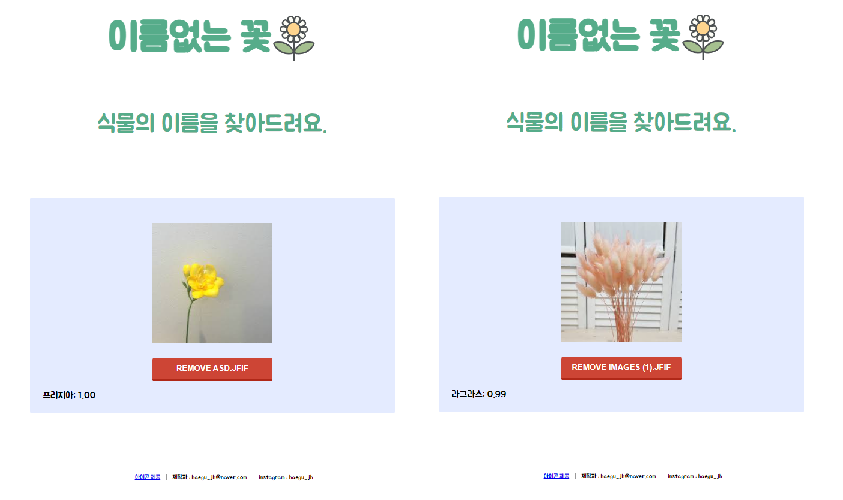
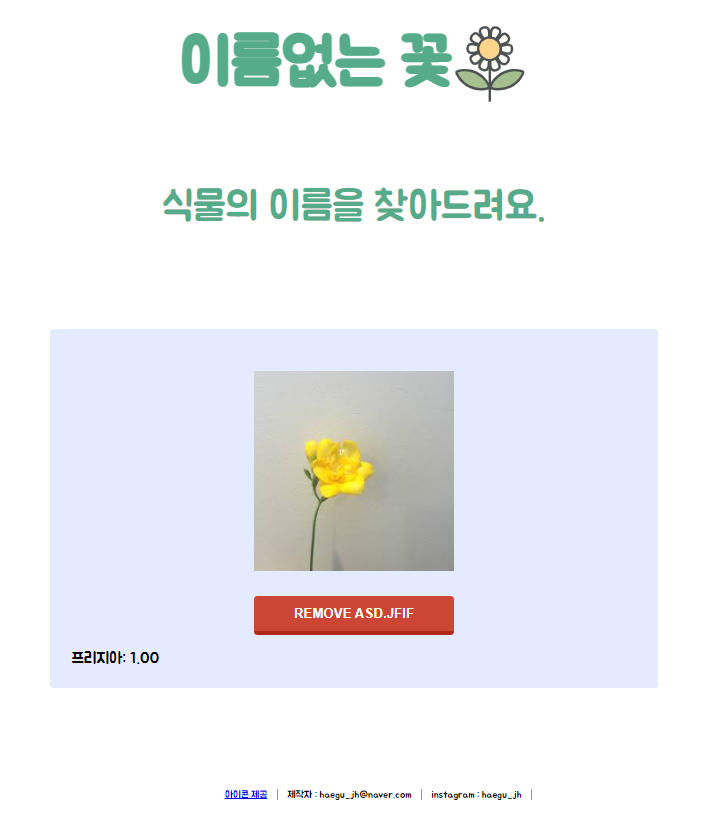
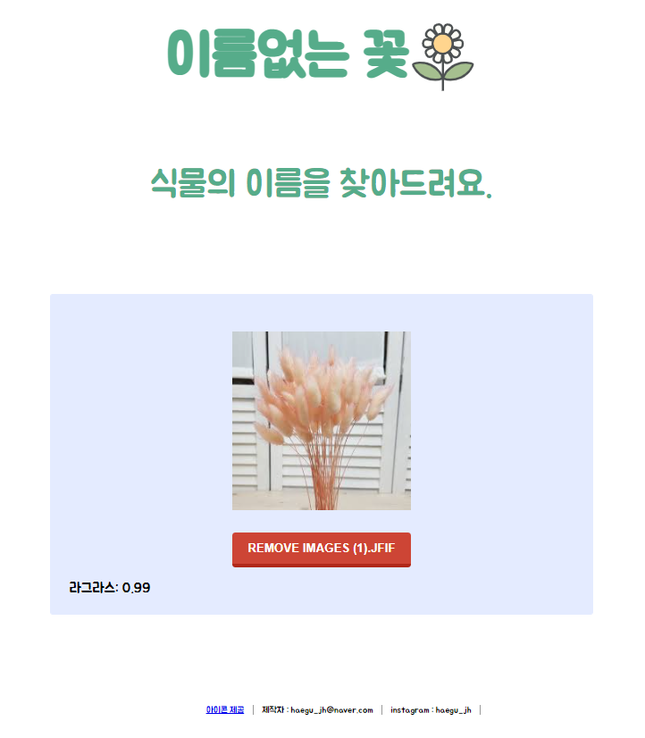
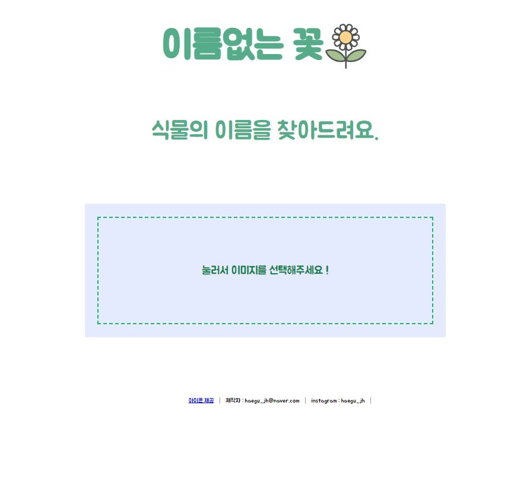

# 티쳐블 머신을 이용한 꽃 이름 찾기    

This Project using teachable machine - Find Flower Name(Classification)

본 프로젝트는 2020/12/1에 시작되었습니다.

<!--  -->   
<!--  -->

 실행 결과 보기 
    

    

프로젝트 진행 과정

## 1. 꽃 이미지 데이터 크롤링

총 ()개의 꽃을 선정했으며, 각 꽃을 '한글'로 검색하여 상위 50개의 이미지를 크롤링 하였다.   
클래스 양에 비해, 각 데이터의 양이 매우 적음을 인지하고 있다.    
또한 시간 관계 상, 해당 과정에서 데이터 정제(Data Cleansing) 를 진행하지 않고 학습 시켰다.    

따라서 아래 두 사항을 차후 최우선적으로 개선할 사항으로 남겨둔다. ( 개선 시 삭제 처리 )    
1. 이미지 추가(Add image)    
2. 데이터 정제(Data Cleansing) 

## Html, css, js

이미지 삽입 전    

     

이미지 삽입 후    

  
